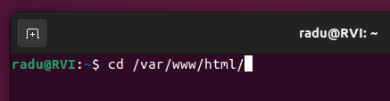
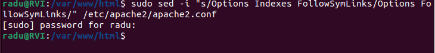
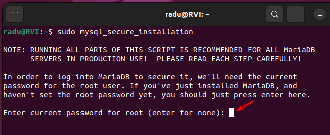
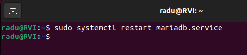

# Instalació de OwnCloud

## Requisits:

* Ubuntu Desktop 22.04 LTS

*****

## Guia de instalació:

1. Primer, mun anirem al nostre terminal i instalarem apache, des de aquesta comanda 

`sudo apt install apache2`

2. Després comprovarem que tinguessim el servei `apache2` que está funcionant. Per tant ho comprovem amb aquesta comanda

`service apache2 status`

3. Ara entrarem al directori que está el contingut del servidor web. Es troba a `/var/www/html`

4. Després posarem aquesta comanda:

`sudo sed -i "s/Options Indexes FollowSymLinks/Options FollowSymLinks " /etc/apache2/apache2.conf
`

5. Una vegada hem fet aixo, després instalarem una base de dades. Instalarem [MariaDB](https://mariadb.org/), una base de dades de codi lliure que farem servir per l'OwnCloud. Per tant, posarem la comanda 

`sudo apt-get install mariadb-server mariadb-client -y
`

6. Una vegada ja la hem instal.lat, la configurarem amb la següent comanda:

`sudo mysql_secure_installation`

Ara en tendriem que posar la nostra contrasenya del nostre usuari de la màquina Linux.

7. Després hauriem de contestar algunes preguntetes sencilles. 

Les respostes que recomano, són aquests:

* Switch to unix_socket authentication > No

* Change the root password? > No

* Remove anonymous users? > Yes

* Remove test database and access to it? > Yes

* Reload privilege tables now? > No

8.  Una vegada acabem les preguntes, 

