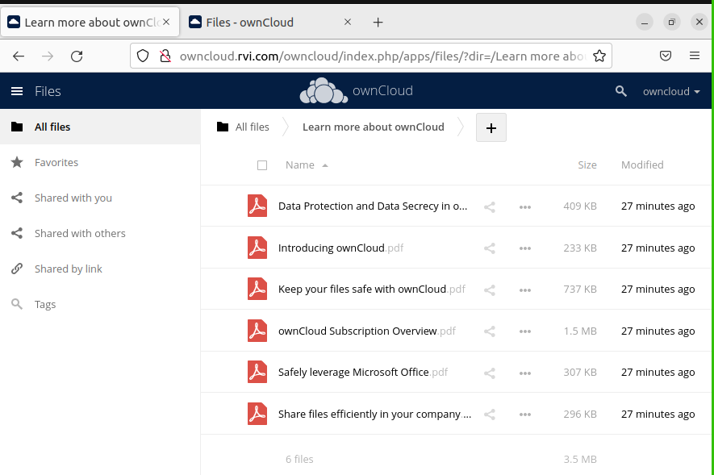
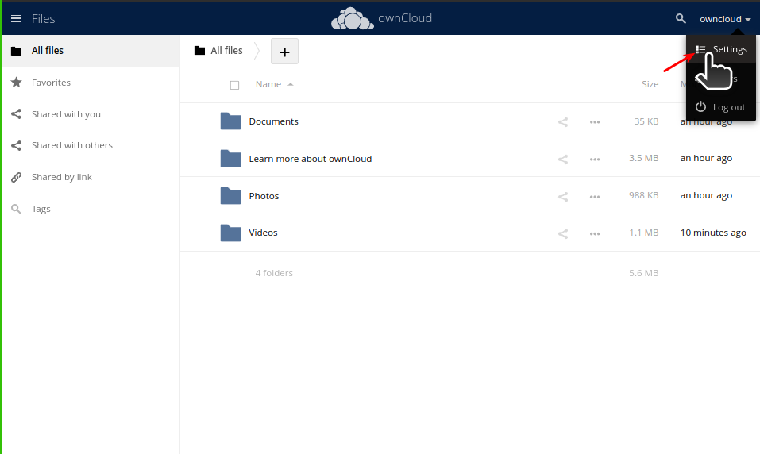
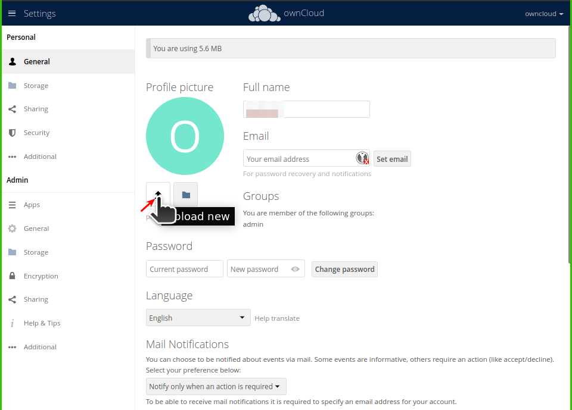
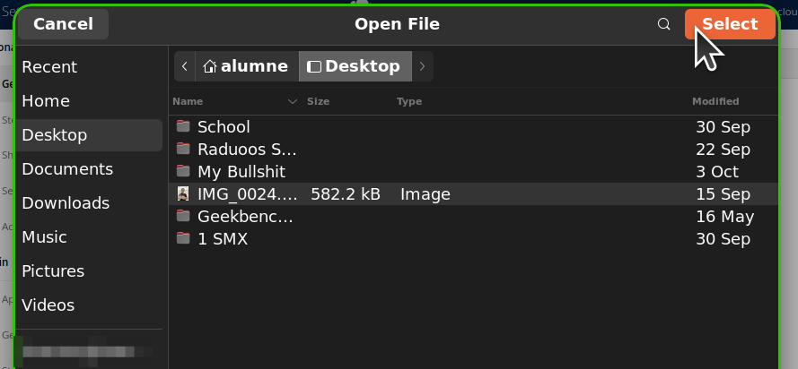
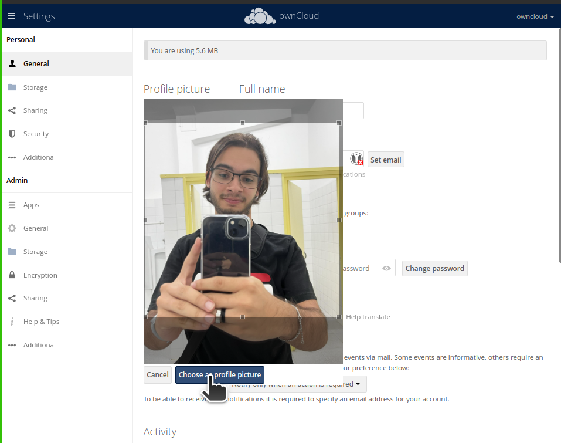
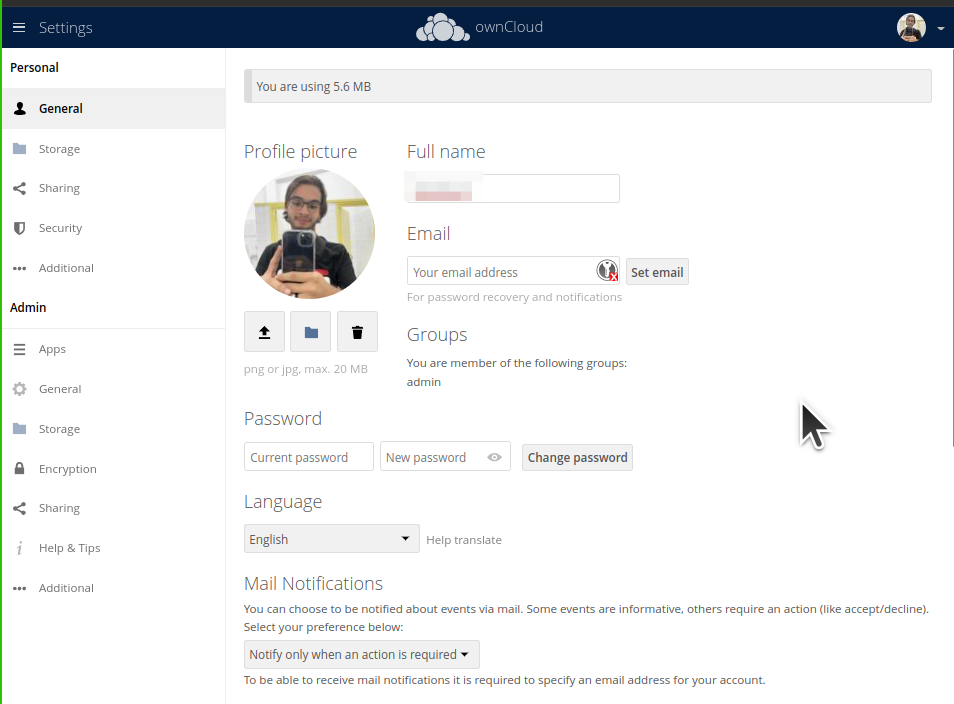
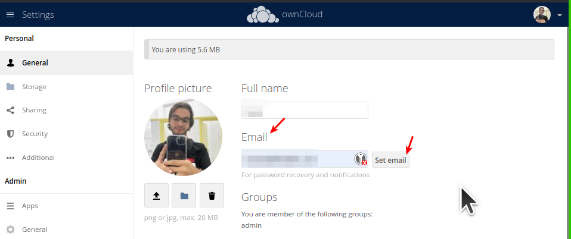
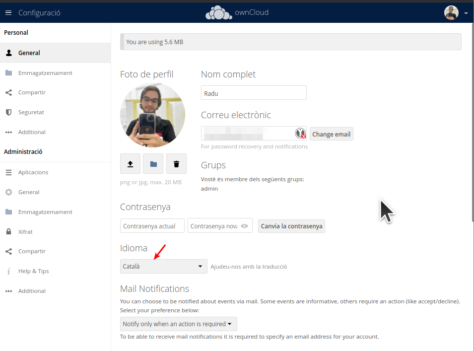
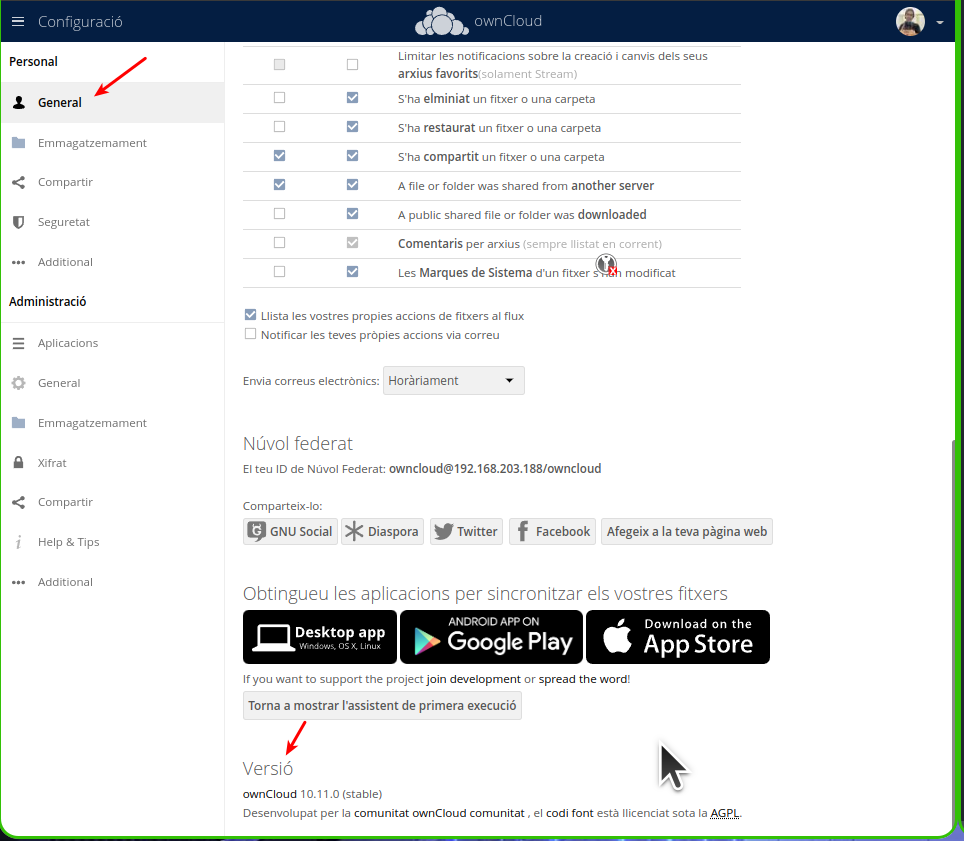

# Activitat 3 / Configuració de OwnCloud

## Llistar Virtual Hosts d'Apache
Ho farem amb la comanda:
```
apache2ctl -S
```

## Respostes

 A Owncloud podem veure que hi ha una serie de carpetes per defecte, mostra la ruta real a les tres carpetes dins de la teva MV.

 * Quin són els tres tipus de protecció de dades que ofereix Owncloud?



 *-Estem veient que porta els següents capes de proteccions de dades*

```
1. Encriptació en Tránsit
```

```
2. Encriptació en descans
```

```
3. Xifratge d'extrem a extrem
```

* Fes una petita descripció de cada un d'ells

```
Encriptació en Tránsit: Assegurat per utilitzar el protocol HTTPS i TLS en navegadors soportats.
```

```
Encriptació en descans: Encripta tot els arxius guardats al servidor OwnCloud. Utilitza clau máster de encriptació per cualsevol sistema d'arxiu
```

```
Xifratge d'extrem a extrem: El nivell de protecció mes alt a l'actualitat. Aquest nivell de protecció no es podra accedir per els administradors del sistema i ningú mes a la organització.
```

* Per quina raó ens recomana utilitzar Owncloud per als documents de Microsoft Office de la nostra empresa?

```
Per si algún usuari accidentalment borra els seus arxius o resinstala el seu sistema operatiu. Igualment per a que no pessin als seus ordinadors per treballar al futur
```

* Això passa a tots els països?

```
No.
```

* Quina és la llicència d'OwnCloud Enterprise?

```
La llicència enterprise es pagada. Desde 25 usuaris mínim i fins 2500+ usuaris en la empresa.

```
| Usuaris | Preu |
| ----------- | ----------- |
| 25 | 12€ al mes i usuari |
| 100 | 9,60€ al mes i usuari |
| 250 | 8€ al mes u usuari |
| 500 | 5,60€ al mes i usuari |
| 1000 | 3,92€ al mes i usuari |
| 2500+ | Al solicitar |


* I la d'Owncloud Standard?

```
És totalment gratuïta i emitida per nosaltres mateix. 
```

* Es poden veure videos en Streaming directament des de Owncloud?

```
En streaming no. Pero si pujem nosaltres mateix, el poden reproduir desde el navegador i sense descarregar
```

* Es poden connectar directoris de Google Drive a Owncloud?

```
No.
```

* I Dropbox?

```
Tampoc
```

* Compta Owncloud amb antivirus? En cas afirmatiu com es diu?

```
No
```

## RESPOSTA

3.4.- Mostra els següents canvis de paràmetres d'usuari:

#  Posa't una imatge d'usuari.

1. Mun anirem als paràmetres de OwnCloud dintre de la pàgina web



2.  Farem click al botó que té una fletxeta per pujar una foto nova desde l'ordinador



3. Triarem la nova foto i li donem a pujar



4. Retallarem la foto que s'adapti a la rodoneta després i la aplicarem 



5. Ja la tenim



# Afegeix el teu mail de l'Institut.

1. Mun anirem als paràmetres de OwnCloud dintre de la pàgina web


2. A l'apartat on tenim la foto de perfil, posarem el nostre email i cuan ja estém, li farem click al boto de Set Email



# Canvia l'idioma a català.

1. Mun anirem als paràmetres de OwnCloud dintre de la pàgina web


2. Veurem paràmetre de llenguatge. Fiquem el que vulguem



# Mostra la versió d'Owncloud instal·lada.

1. Mun anirem als paràmetres de OwnCloud dintre de la pàgina web


2. A l'apartat de General, baixarem abaix de tot de la pàgina i veurem la versií 

```
ownCloud 10.11.0 (stable)
```


