# Activitat 4

## Gestió d'usuaris

...

### Activitats:

## 4.1.- Crea un usuari admin que es digui adminXYZ, on XYZ són les inicials del teu nom:

1. Primer hem de anar al nostre OwnCloud

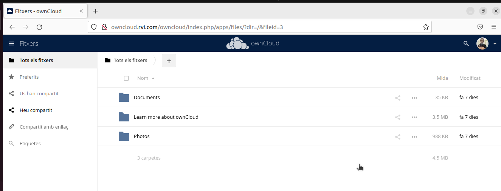

2. Després hem d'anar a l'apartat de Usuaris que es troba a les opcions on tenim la foto de perfíl

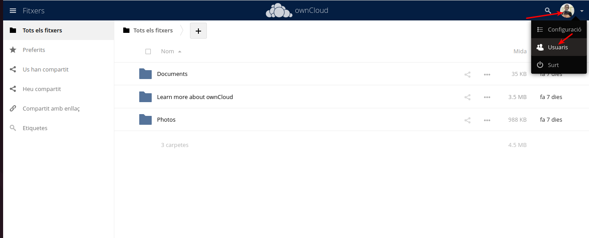

3.  Una vegada estem ahi, directament podem introduir un nom nou, el seu correu i grup que li volem assignar

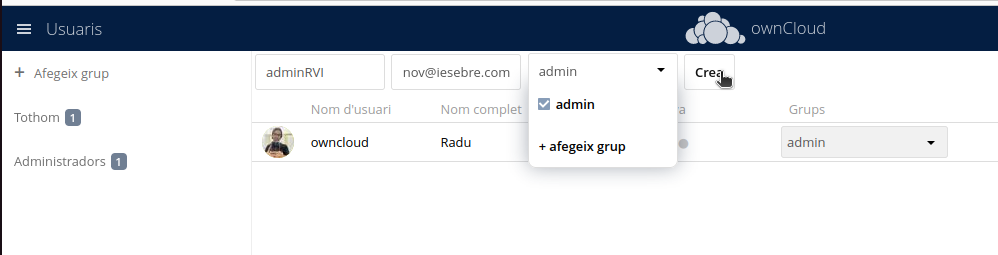

4. Cuan ja ho hem fet, li posarem una contrasenya

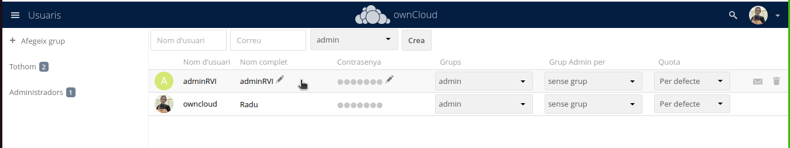

## 4.2.- Inicia sessió com a l'usuari adminXYZ.


- Hem iniciat sessió correctament a l'usuari adminRVI

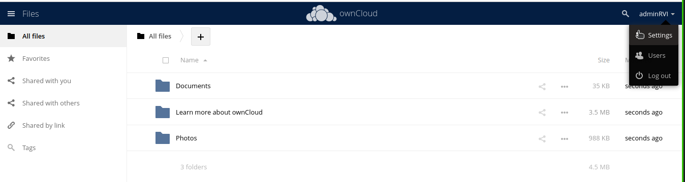

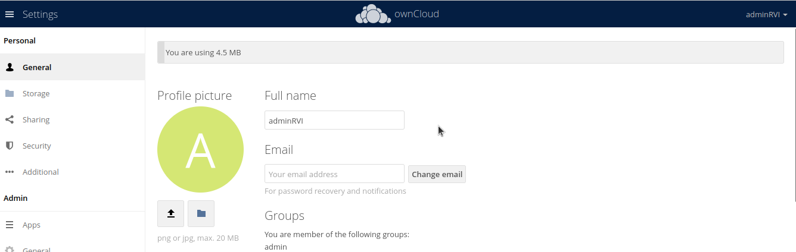


## 4.3.- Crea un usuari XYZ on XYZ son les inicials del company/a i afegeix-lo al grup usuaris, aquest usuari tindrà una quota de 512 MB.

- Ho farem amb la mateixa comanda, pero creare un group, i un límit de fitxers.

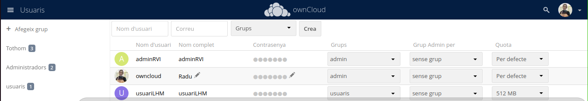


## 4.4.- Podem crear fitxers d'una mida determinada a Linux amb la comanda:

1. Obrirem un terminal i mun anirem a cualsevol directori

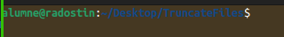


2. Ahi farem la comanda per crear fitxer pesats: 

```
sudo truncate -s 100M fitxer.txt
```


## 4.5.- Mostra e4.5.- Mostra el missatge d'error per haver superat la quota d'usuari.

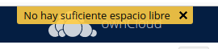

Això passa perque ja hem ocupat tot l'espai de la seva quota del administrador

## 4.6.- Busca al teu perfil quin percentatge de quota estas utilitzant.

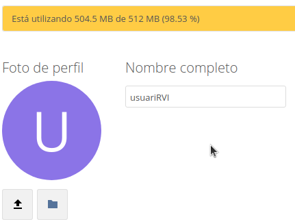

## 4.7.- Canvia la quota de l'usuari a 1GB i mostra tots els fitxers pujats.

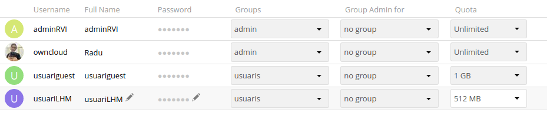

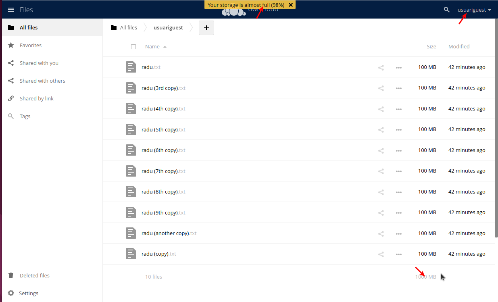

## 4.8.- Crea un usuari anomenat usuari2XYZ i fical al grup usuaris.

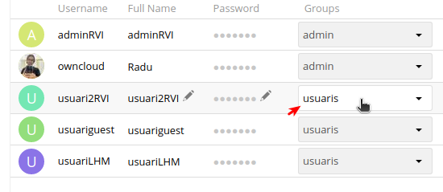

## 4.9.- Comparteix un fitxer de usuariXYZ a usuari2XYZ i mostra com l'usuari2XYZ pot veure i descarregar el fitxer.
Usuari 1

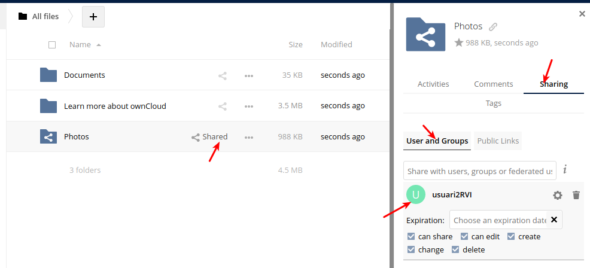

Usuari 2


## 4.10.- Esborra la carpeta Learn more about owncloud.

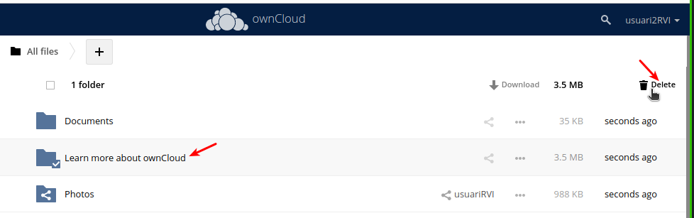

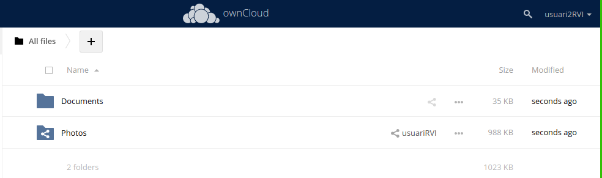

## 4.11.- Recupera la carpeta Learn more about owncloud.

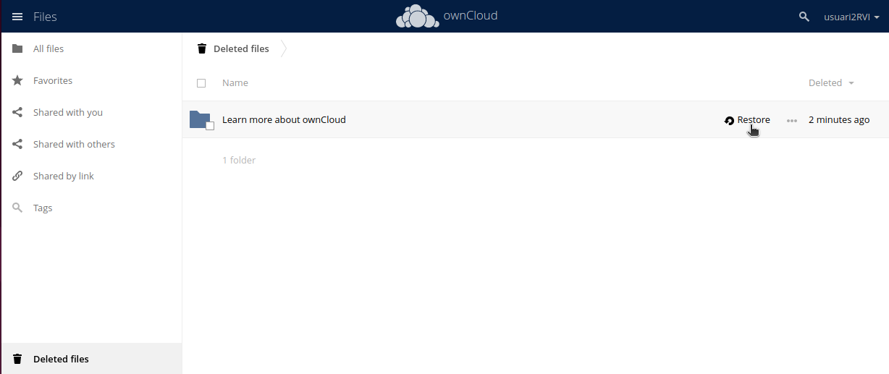

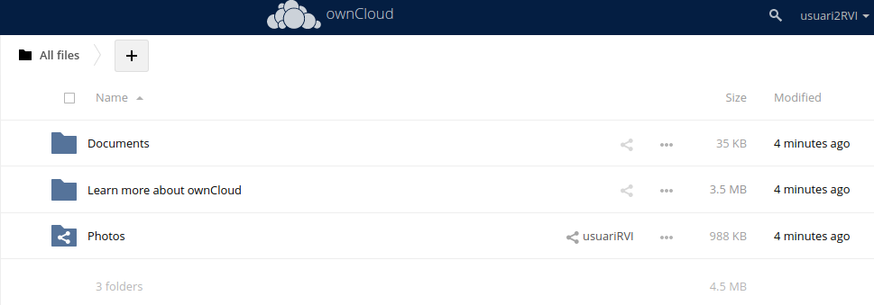

## 4.12.- Com a usuariXYZ crea una carpeta nova anomenada shared i comparteix-la amb l'usuari usuari2XYZ.

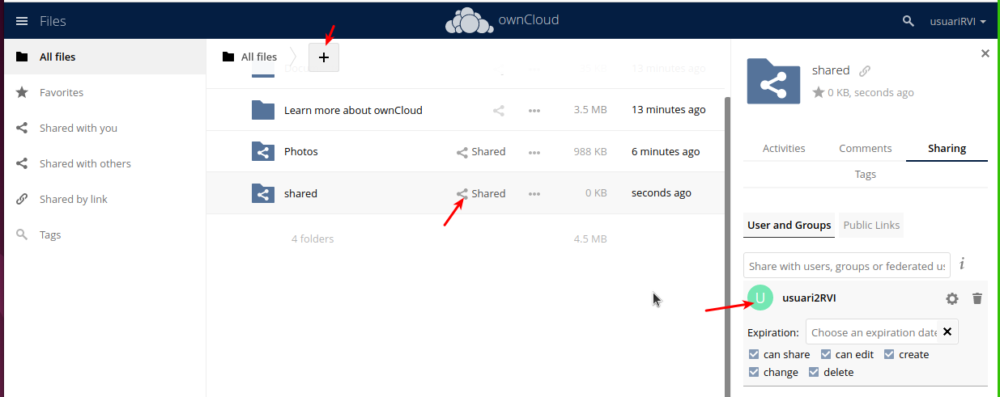

## 4.13.- Entra a Market instal·la dues aplicacions que no estiguin ja instal·lades i explica què fan i com funcionen.

* 1 - Gallery

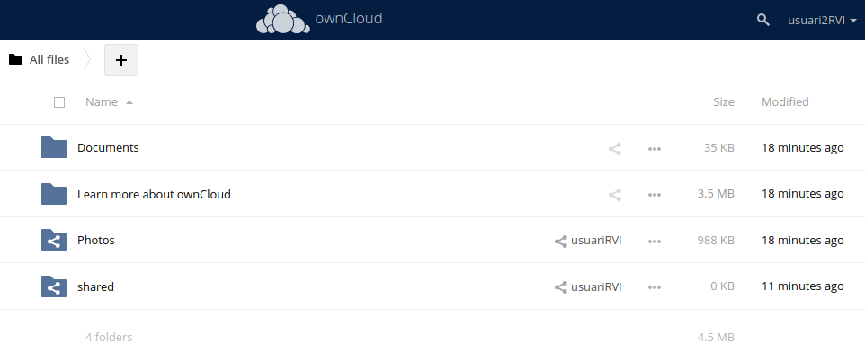

Gallery és una aplicació que permet visualitzar les fotos pujades en vista de gallería real, que veure un llistat dels arxius imatges

* 2 -  Tasks

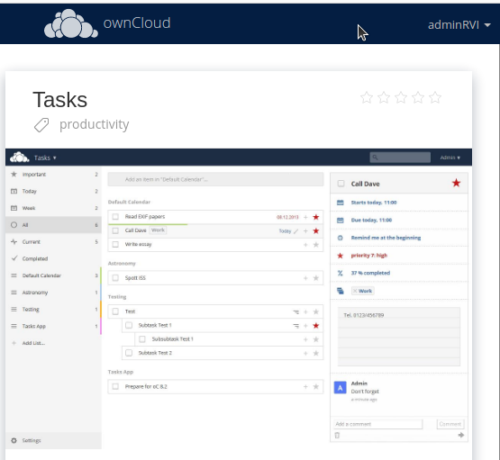

Tasks permet classificar i planificar tasques de forma cómoda. 


Aquestes extensións, són com applicacions intergrades dintre del nostre OwnCloud. Només tenim que desplegar el menu, i ja els veuriem

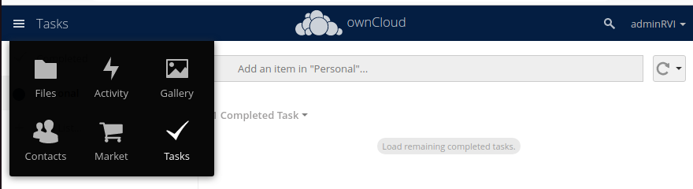

## 4.14.- Crearem una carpeta nova per emmagatzematge a Owncloud, la carpeta serà /media/publicXYZ on XYZ són les teves inicials i apareixerà amb el nom de public als usuaris.


## 4.15.- Connectarem la carpeta publicXYZ com emmagatzematge local, tal i com s'indica aquí. Tots els usuaris tindran accés a la carpeta.

1. Hauriem de editar el fitxer config.php:

```
sudo nano /var/www/html/owncloud/config/config.php
```

2. A algúna de les línies posarem aquesta línia:

```
'files_external_allow_create_new_local' => 'true',
```

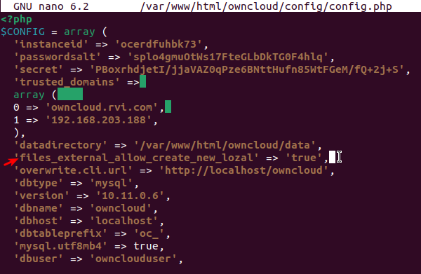


3. Ara hem d'anar a la nostra configuració de OwnCloud 

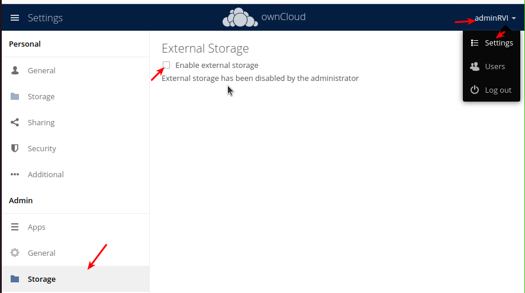


4. Després mun anirem a l'apartat de admin, storage i després ho farem així.

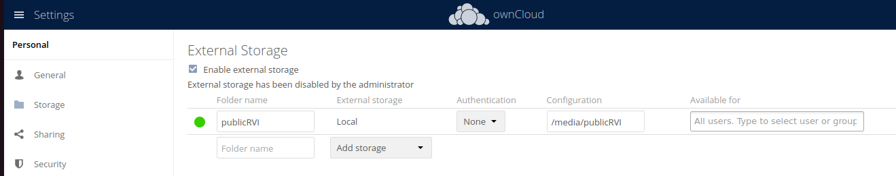


## 4.16.- Un usuari normal pujarà un fitxer a la carpeta public.

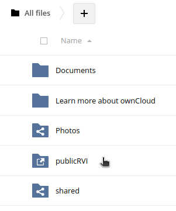

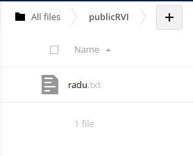

## OPCIONAL: No em surt / funciona


