# Activitat Moodle v.4.5 | Instalació i Configuració

## Veurem com instalar Moodle i configurar-lo en un Ubuntu Server.
****

# Instalació: 

1: Actualitzarem els paquets abans de fer tot

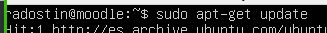

2: Després instalarem apache2 amb aquesta comanda

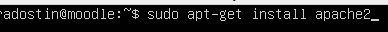

3: Una vegada hem fet tot això, instalarém MariaDB <3

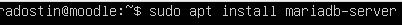

4: Després posarem aquesta comanda per configurar mysql

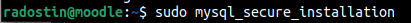

5: Posarem els paràmetres així


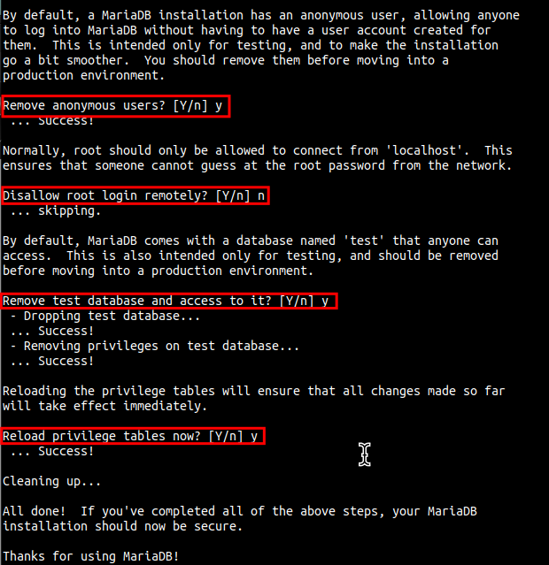

6: Una vegada hem configurat MySQL, afegirem el repositori per descarregar PHP

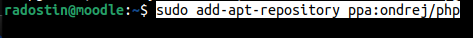

7:  Actulitzarem els paquets

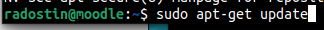

8: Farem utilitzar aquesta comanda per instalar php7.3

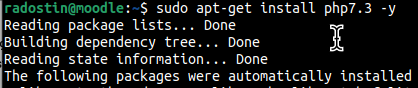

9: Després descarreguem el fitxer zip de moodle amb la següent comanda:

``` wget https://download.moodle.org/download.php/direct/stable400/moodle-latest-400.zip ```

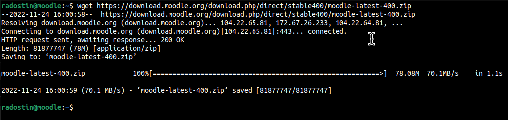

10:  Una vegada ho hem descarregat, instalarem unzip i descomprimirem el fitxer .zip al directori de apache2

```sudo apt install unzip```

```unzip (paquet.zip)```
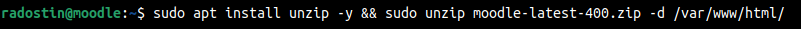

11: Una vegada descomprimit ficarem permisos publics al directori de moodle

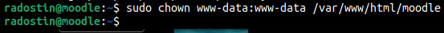

12: Entrarem a la carpeta home i farem una nova carpeta especial per moodle. Després li posarem permisos per al public també.

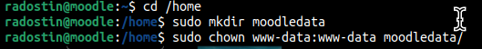

13: Una vegada hem fet tot això, entrarem a MariaDB amb aquesta comanda

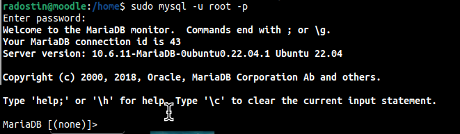

14: Ficarem un nou usuari amb una contrasenya managermoodle

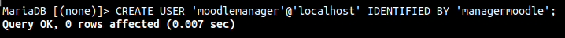

15: Després crearem la base de dades. 

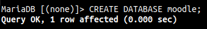

16: Ficarem permisos al usuari que hem creat a la base de dades

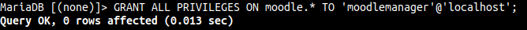

17: Finalment posarem aquesta comanda i surti,

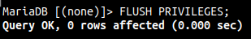

18: Una vegada hem fet tot estos passos correctament, per comprovar que hem fet tot bé, entrarem amb la adreça IP de la màquina o localhost/moodle. Si ens funciona, seleccionarem un llenguatge i li donarem a següent


19: Ara ens diu que ens falta alguns paquets. Per tant els instalarem amb la següent comanda

```
sudo apt install php7.3-curl -y
sudo apt install php7.3-zip -y
```

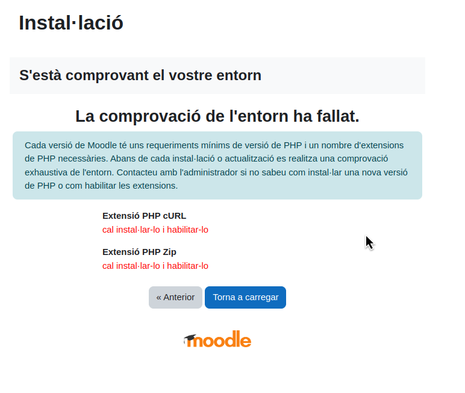

20: Després reiniciarem el servidor web amb aquesta comanda
```
sudo service apache2 reload
```

21: Un cop ho tenim reiniciat vorem aquesta pantalla. Aquí hauriem de posar aquest directori al tercer camp

```
/home/moodledata
```

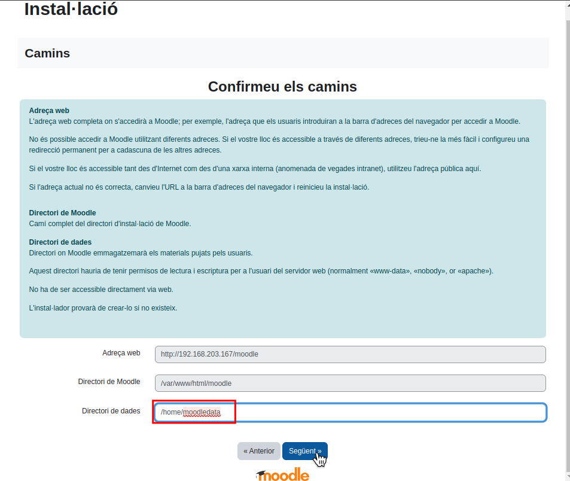

22: Un cop hem donat següent, hauriem de seleccionar la base de dades MariaDB

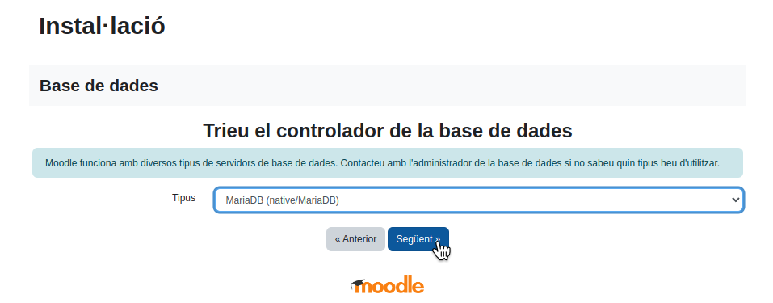

23: Després hauriem de emplenar els camps amb les dades que vam omplir cuan vam configurar la base de dades

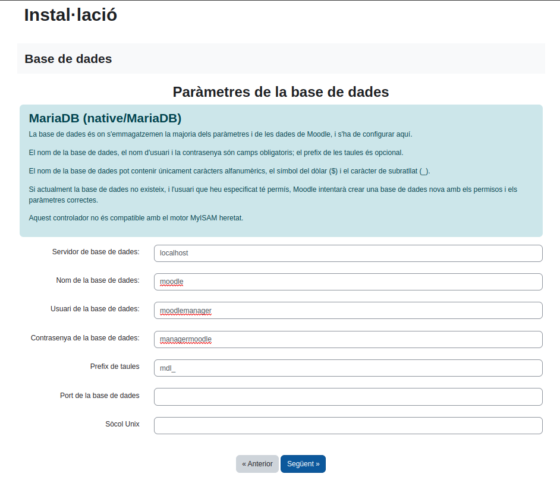

24: Després instalarem els següents ordres

```
sudo apt install php7.3-mysql
sudo apt install php7.3-xml
sudo apt install php7.3-mbstring
sudo apt install php7.3-gd
sudo apt install php7.3-intl
sudo apt install php7.3-xmlrpc
sudo apt install php7.3-soap

sudo service apache2 restart
```

25: Després cuan tinguesim la pàgina reiniciada, veurem aquesta pantalla. Li donarem a continuar per aceptar els termes de condicio

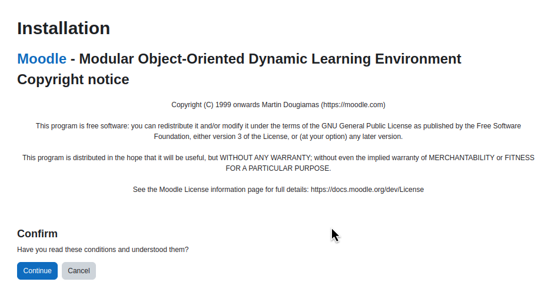

26: Després ens apareixerà una altra finestra amb tots els continguts que els está verificant moodle per la instalació necessària


27: Una vegada hem fet continuar, es començara la instalació de moodle. Un cop finalitzada farem click en continuar

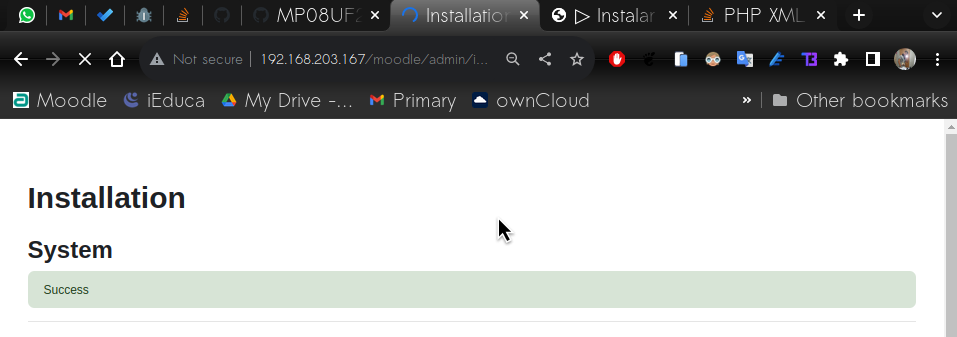
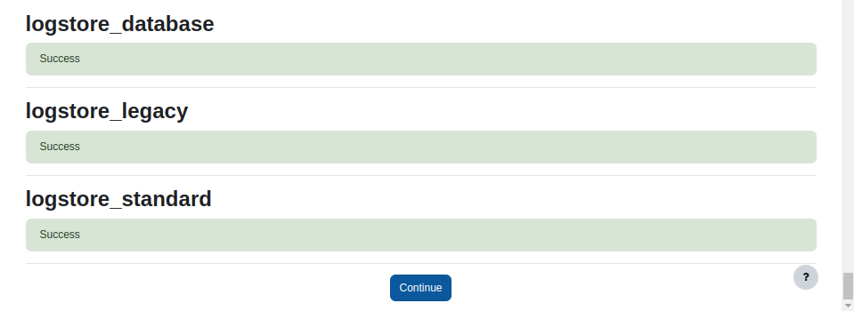


28: Aqui tenim que omplir dades com nom d'usuari, contrasenya, email, etc. Un cop hem acabat farem click en següent

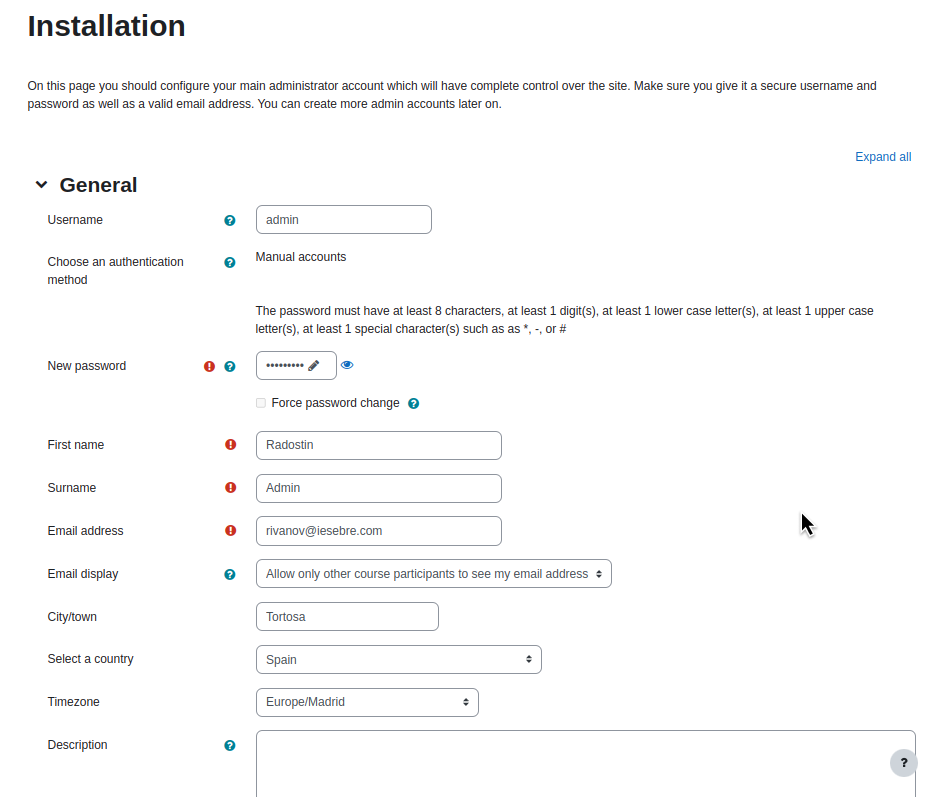
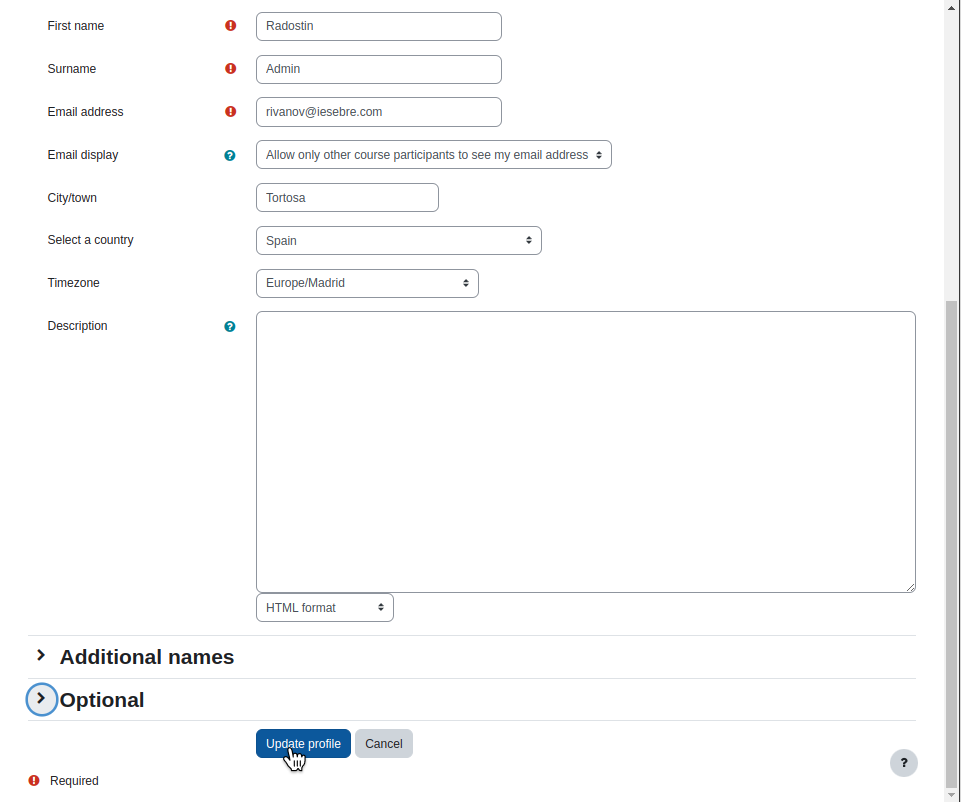

29: Després posarem informació per el nostre moodle. Nom, Descripció, Zona horaria, etc.

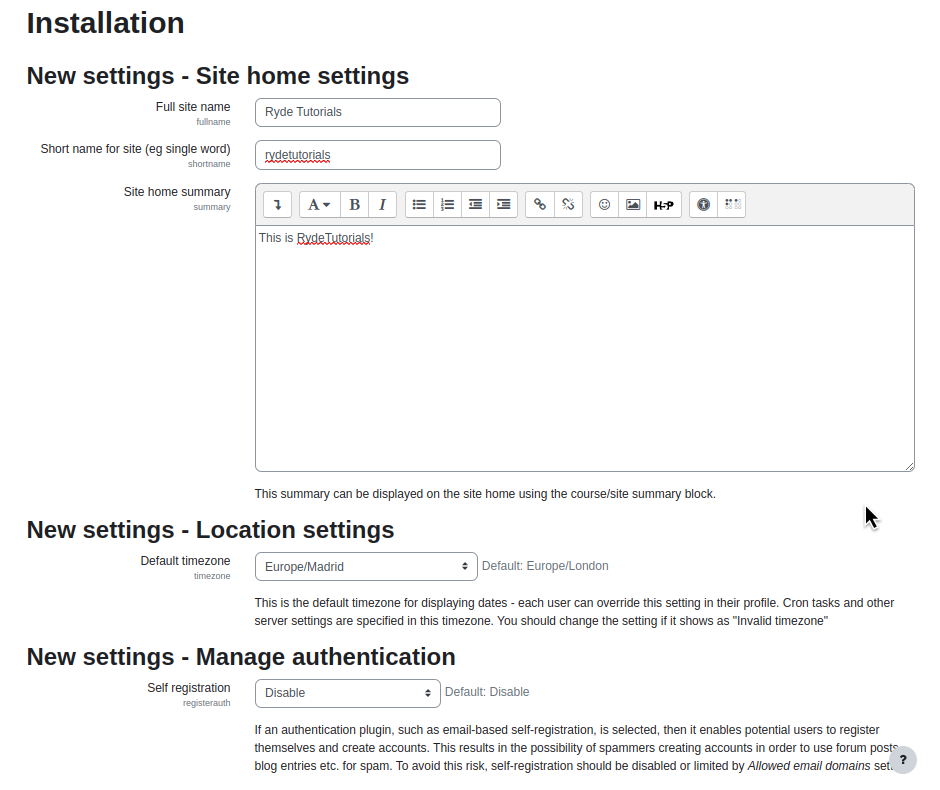
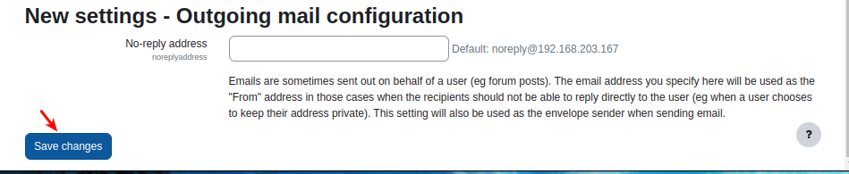

30: Ja tenim el nostre moodle listo per utilitzar!

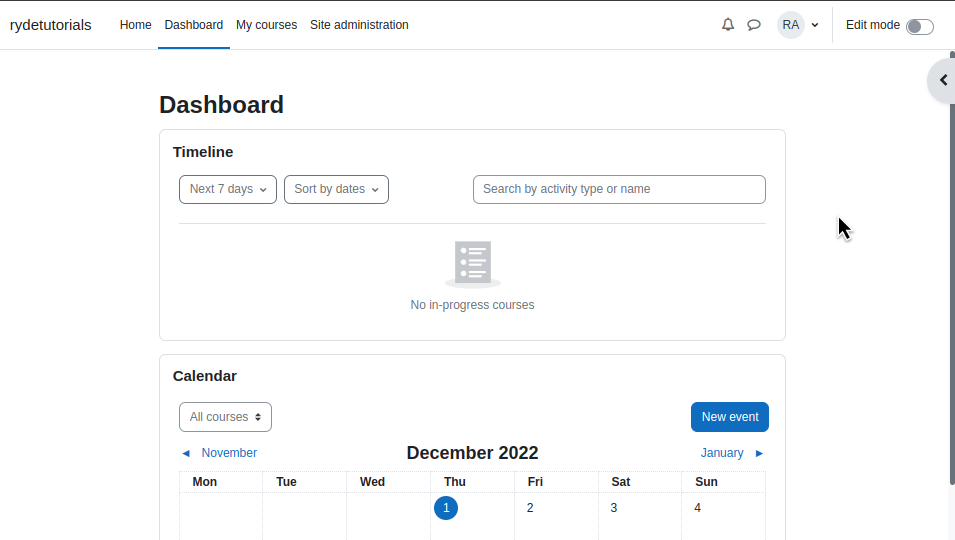
