# Activitat Moodle v.4.5 | Personalització, Cursos, Seguretat, Temas

# Personalització perfil:

---

## Entra a un usuari de Moodle i personalitza el seu perfil amb una imatge.

1. Mun anirem a site administration > users > browse list of users

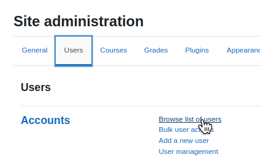

2. Entrarem en algun dels perfils. 

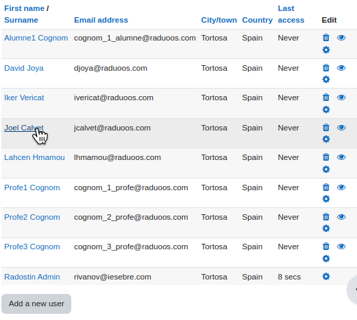

3. Ara farem click en el botó de editar perfil

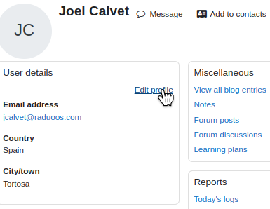

4. Baixarem abaix de tot on trobessim user picture. Pujarem una i aplicarem els canvis

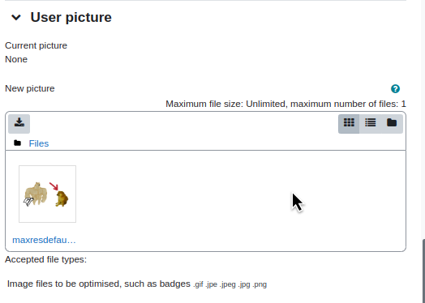

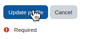

5. Ja hem pogut canviar la seva foto :)

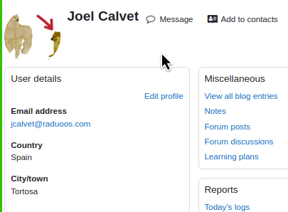

---

## Canvia la seva contrasenya.

1. Anirem on hem anat abans al usuari, i seleccionarem edit profile

2. Anirem a edit profile

3. On fica password clickem sobre el text i posarem la nova contrasenya. Un cop fet li donarem actualitzar perfil

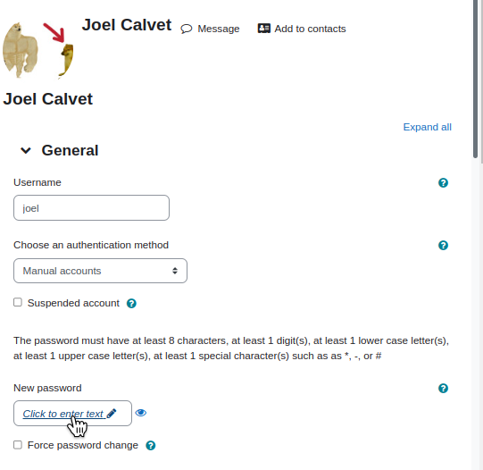

---

## Canvia el seu idioma preferit a anglès.

1. Anirem a l'usuari i entrarem en edit profile

2. Després anirem a Preferences que es troba a l'apartat de administració. 

3.  Seleccionarem preferred language

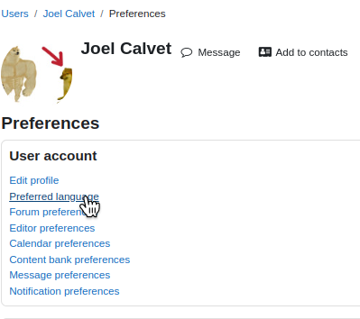

4.  I ara ja el cambiarem. Un cop fet aplicarem els canvis i ja estaría.

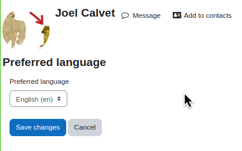

## Oculta el seu mail a usuaris sense permisos.

1. Anirem a edit profile altra vegada

2. Ara ficarem aquesta opció en hide i aplicarem els canvis

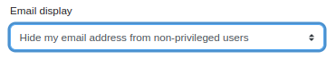

---

## Canvia el primer dia de la setmana del calendari a Diumenge.

1.  Mun anirem a site administration > appearance > calendar

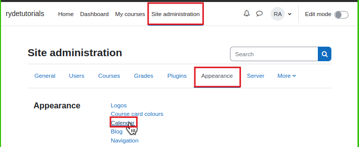

2. Cambiarem els camps "Start of week i weekend days". Un cop fet aplicarem els canvis.

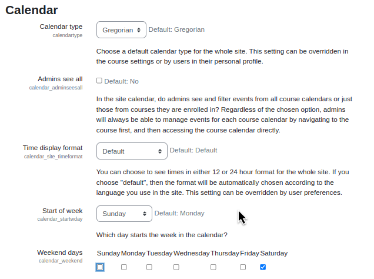

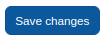

## Fes que només els contactes de l'usuari puguin enviar-li missatges.

1.  Mun anirem a les preferències de l'usuari

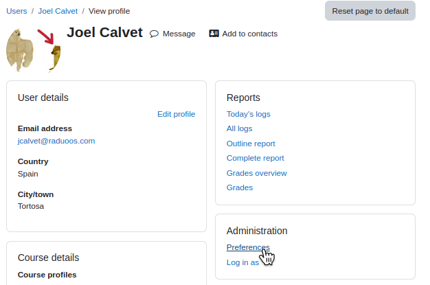

2. Seleccionarem message preferences

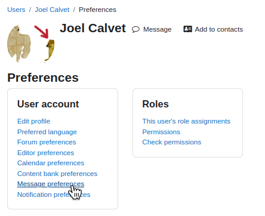

3. I ara fem click a My Contacts Only i ja está guardat automàticament.

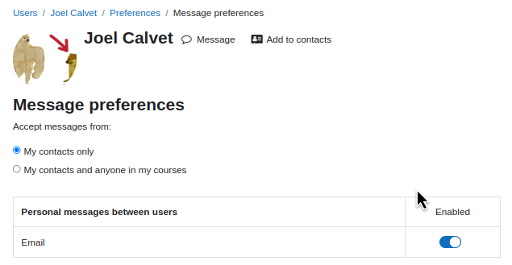

---

# Cursos:

## Crear curs, assignar alumnes, professors, forum general, qualify, etc.

1. Mun anirem a site administration > courses > manage courses and categories. Primer anirem a fer un curs

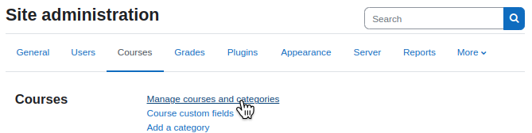

2. Seleccionarem el curs i el modul que li volem fer un curs

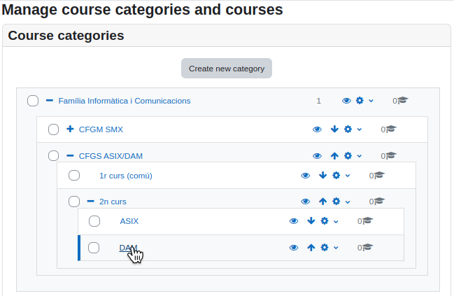

3. Un cop seleccionat el módul, podem fer un nou curs

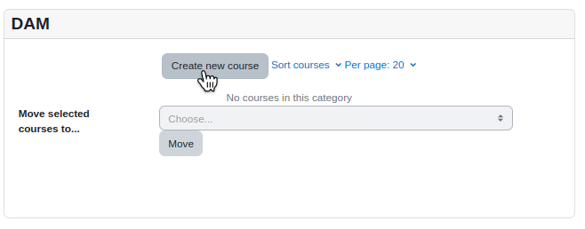

4. Posarem dades com nom, nom curt, etc. 

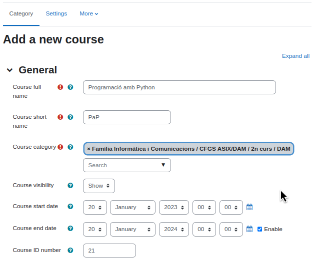

5. Un cop hem acabat de posar totes les dades farem click en aquest botó

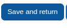

6. Un cop el tenim creat, el anirem a editar

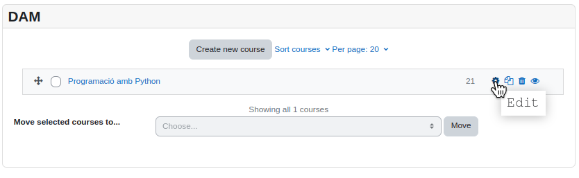

7. Ara mun anirem a participants i afegirem els alumnes i els profes que ens toca.

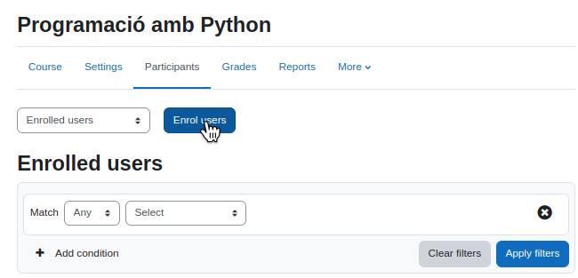

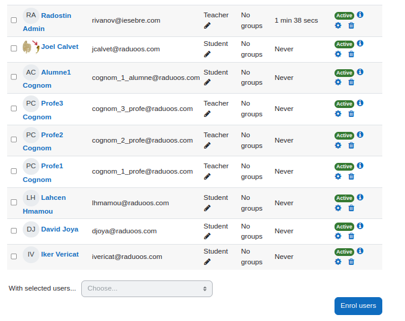

8. Un cop fet això, ara anirem a afegir consultes per a que els profes puguin resoldre dubtes dels alumnes per cualsevol cosa. Activarem mode edit que és troba adalt de tot a la dreta

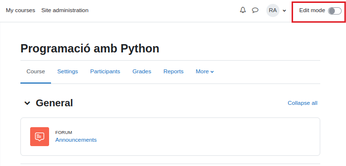

7. Mos assegurem que ens trobessim en course i farem el plus de baix

8. Seleccionarem forum

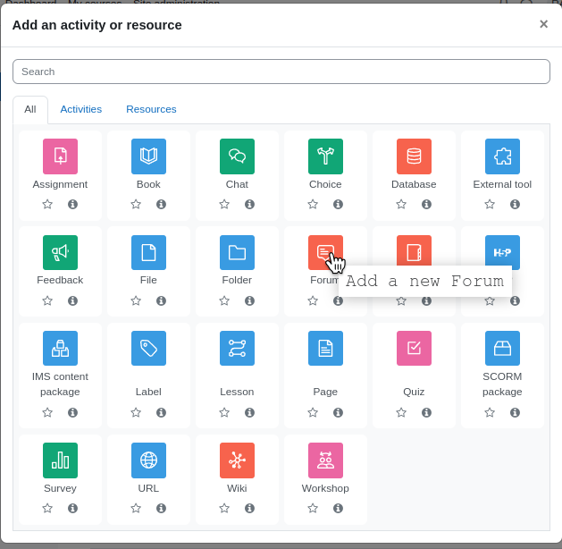

9. El nombrarem i podem seleccionar de cualsevol tipus de forum. Q&A, etc.

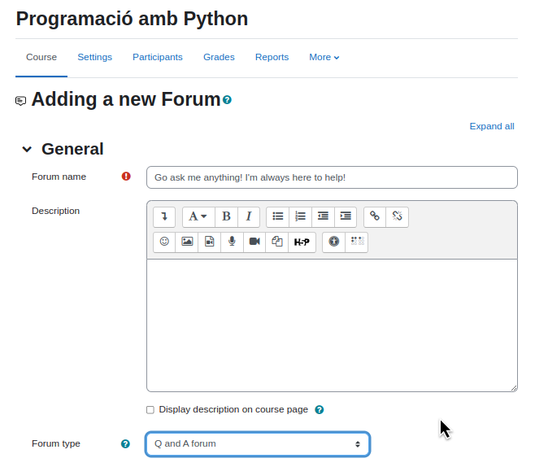

10. Posarem data de termini si volem i un cop hem fet això ja el podem publicar. Farem click al botó blau.

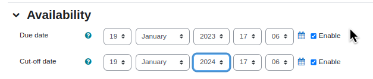

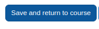

11. Ara entrarem dins i mun anirem a suscripcións. Després seleccionarem que sigui suscripcións forçades, per a que la gent pugui estar dintre obligatòriament.

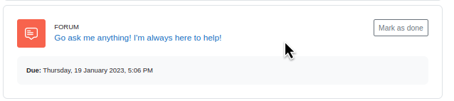

12. Un cop fet això, anirem a editar el Topic 1 per ficar un tema 1. El renombrarem fent click sobre el llapiset i li ficarem un nou nom.

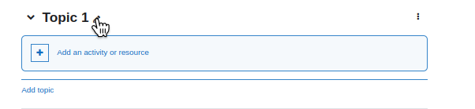

13. Després d'això volem ficar una activitat que sigui una avaluació inicial, fent el mateix procés per la consulta així com Assignment. Després li ficarem un titol, instruccións, i el fitxer de contingut o activitat. Un cop acabat de fer això, ja podem publicar la nostra activitat al nostre mòdul.

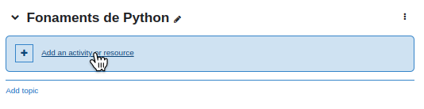

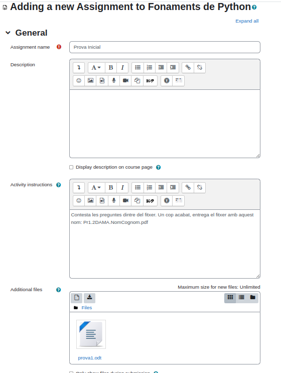

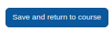

12. Ja el veurem que apareix correctament.

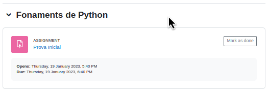

13. Ara volem amagar els altres temes si no en tenim un altre, fent click als tres puntents i li ficarem hide topic per a que no sigui visible per els estudiants.

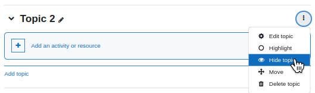

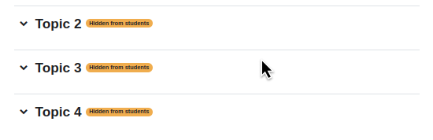

14. Ara surtirem de la sessió de administrador i entrarem amb un alumne a comprovar que tot ens funciona. 

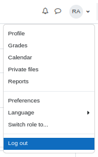

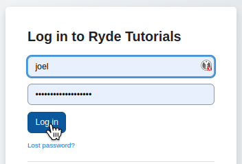

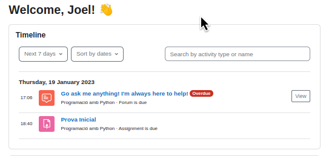

15. Veurem que el curs ens surt correctament i ara anirem a veure la discussió

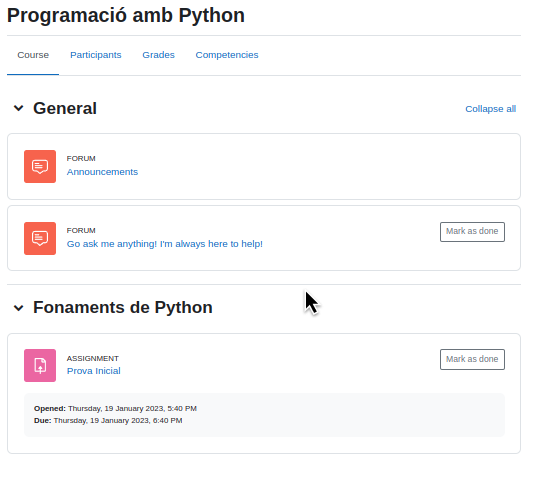

16. Fem click al botó blau per començar una nova discusió, i després escrivirem la pregunta o alguna cosa.

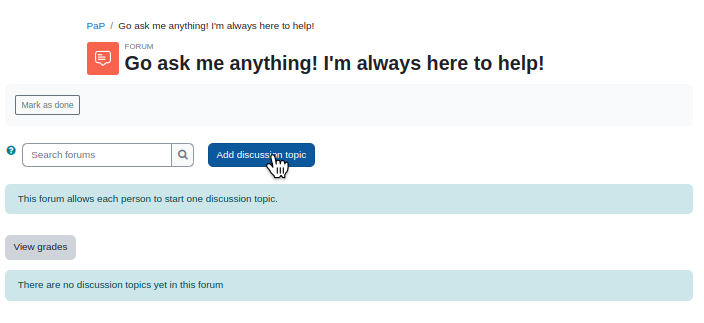

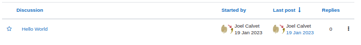

17. Veurem que un altre alumne també pot fer consulta.

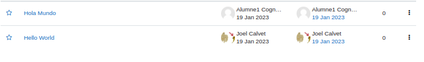

18. Ara provarem de contestar desde un professor.

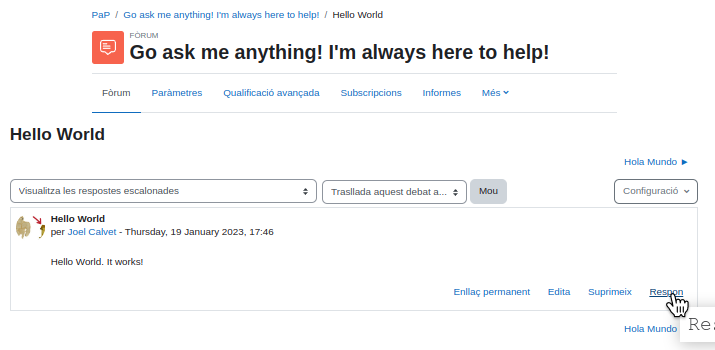

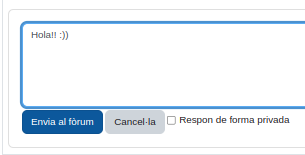

19. Veurem que funciona correctament

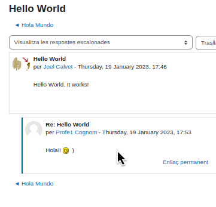

20. Ara intentarem contestar desde un altre alumne.

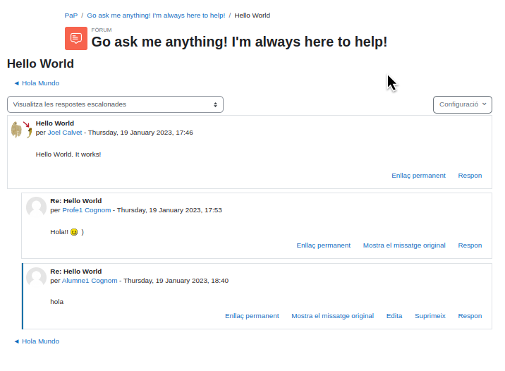

21. Aqui veurem el procés d'acabament d'una tasca.

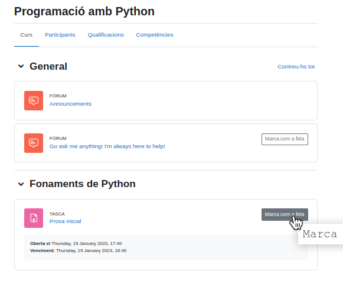

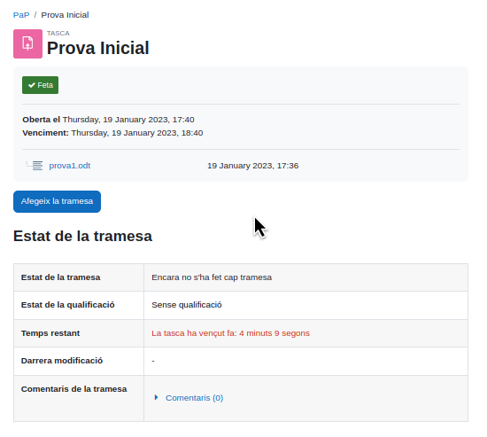

22. Ara anirem a valorar els alumnes 

23. Així es veuría una vista desde l'alumne

---

# Seguretat

## Bloquear una IP per a que no pugui accedir

1. Mun anirem a Site administration > General i baixarem abaix de tot a seguretat. Seleccionarem IP blocker

2. Ficarem la IP de la màquina que volem bloquejar al camp Blocked IP List i apliquem els canvis.

3. Ara provem de entrar desde la màquina bloquejada i veurem que no podem accedir.  

---

# Plugins

## Com instalar plugins

1. Mun anirem a la página oficial de moodle. Ahi están tots els plugins. Seleccionarem un

2. I li donarem a Download

3. Un cop instalat, mun anirem al nostre moodle > administration > plugins i instalarem plugins

4. Pujarem l'arxiu ZIP i el instalarem. 

Aquest plugin Dash es un personalitzador de interfaz de moodle.

Tenim un altre que hem trobat i trata de ChatGPT de OpenAI intergrat al nostre moodle. 

# Personalització del tauler d'usuaris. 

## Canvi del tauler d'usuaris "cursos visitats recentment"

1. Primer que tot hauriem d'anar a Aparença i seleccionarem Default Dashboard page

2. Ara aqui activarem mode edició que es troba adalt de tot a la dreta i seleccionarem el botó blau per afegir un bloc nou.

3. Afegirem el bloc que diu Recently accessed courses

4. El mourem cap a dalt i ja ho tindrém. Un cop fet tot això, ja podem deshabilitar mode edició i els canvis s'aplicaran correctament. 

## Afegeix a baix de tot "Usuaris en línia".

1. Farem servir el mateix procés d'abans, pero aquesta vegada hem de triar Online Users 

2. Ja ho tindrém abaix de tot per defecte. 

# Canvia el tema del Moodle:

## Com canviem el tema del nostre moodle?

1.  Mun anirem a la página web i en trairem un

2. Ara hem de posar el fitxer descarregat a la nostra instalació de moodle. Per tant en el nostre cas la tenim en /var/www/html/moodle/theme! Si estem tenint una maquina virtual, mos asegurem que té el adaptador pont i el connectarem amb el real nostre utilitzant la ordre scp

3. Un cop está a la nostra màquina virtual, el mourem al directori de instalació de moodle

4.  Després entrarem dins de /theme i descomprimem l'arxiu

5.  Veurem que aquesta pantalla, ens falta una dependencia que ha deixat de ser desenvolupada i no hi ha cap solució.

