# Instalació de OwnCloud

## Requisits:

* Ubuntu Desktop 22.04 LTS

*****

## Guia de instalació:

1. Primer, mun anirem al nostre terminal i instalarem apache, des de aquesta comanda 

```
sudo apt install apache2
```

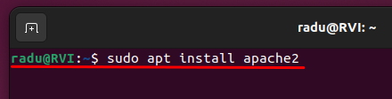


2. Després comprovarem que tinguessim el servei `apache2` que está funcionant. Per tant ho comprovem amb aquesta comanda

```
service apache2 status
```

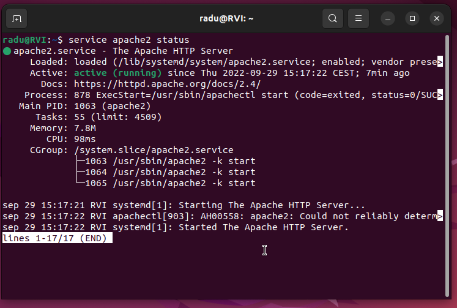


3. Ara entrarem al directori que está el contingut del servidor web. Es troba a `/var/www/html`


4. Després hem de desactivar el llistat de directoris per a que la gent no es veigui els nostres arxius posarem aquesta comanda:

```
sudo sed -i "s/Options Indexes FollowSymLinks/Options FollowSymLinks " /etc/apache2/apache2.conf
```


5. Una vegada hem fet aixo, després instalarem una base de dades. Instalarem [MariaDB](https://mariadb.org/), una base de dades de codi lliure que farem servir per l'OwnCloud. Per tant, posarem la comanda 

```
sudo apt-get install mariadb-server mariadb-client -y
```

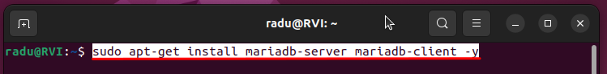


6. Una vegada ja la hem instal.lat, la configurarem amb la següent comanda:

```
sudo mysql_secure_installation
```

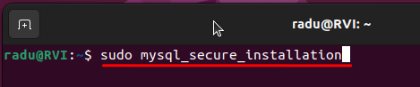

Ara en tendriem que posar la nostra contrasenya del nostre usuari de la màquina Linux.


7. Després hauriem de contestar algunes preguntetes sencilles. 

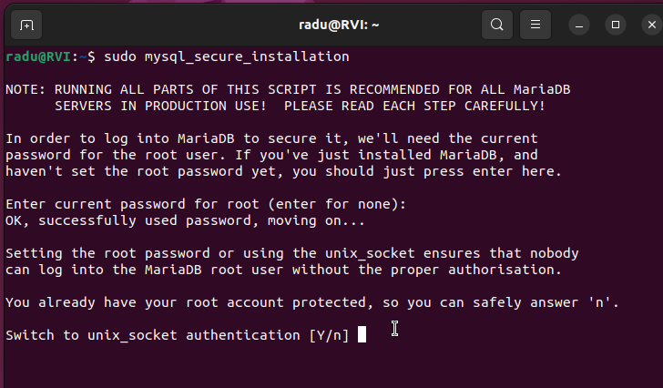

Les respostes que recomano, són aquests:

* Switch to unix_socket authentication > No

* Change the root password? > No

* Remove anonymous users? > Yes

* Remove test database and access to it? > Yes

* Reload privilege tables now? > No

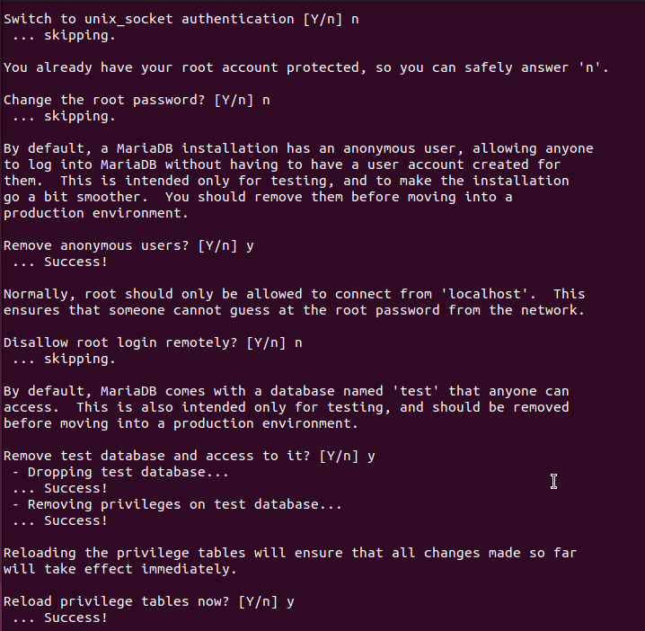


8.  Una vegada acabem les preguntes, reiniciarem el servei de base de dades


9. Després cuan la tinguessim reiniciada, entrarem en MariaDB amb la comanda

```
sudo mysql -u root -p
```

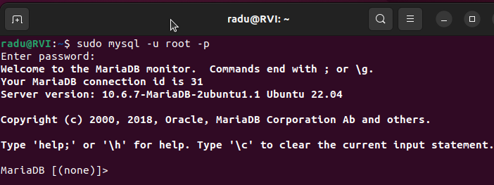


10. Una vegada estem dins, crearem una nova base de dades així:

```
CREATE DATABASE owncloud;
```


11. Després crearem un nou usuari de aquesta manera. :

```
CREATE USER 'ownclouduser'@'localhost' IDENTIFIED BY 'Admin1234';
```


12. Donarem accés a l'usuari per la base de dades. Mos asegurem que fiquem el usuari i la contrasenya seva que correspon

```
GRANT ALL ON owncloud.* TO 'ownclouduser'@'localhost' IDENTIFIED BY 'Admin1234' WITH GRANT OPTION;
```


13. Aplicarem els canvis i surtirem de l'assistent, amb les comandes 

```
FLUSH PRIVILEGES
```
 i 
 ```
 EXIT
 ```


14. Una vegada estem fora de MariaDB, ens prepararem per la instalació de PHP i els seus moduls necessaris. Primer executarem aquesta comanda:

```
sudo apt-get install software-properties-common -y
```

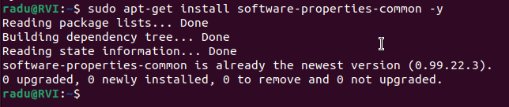


15. Després afegirem un repositori per PHP, executarem aquesta comanda:

```
sudo add-apt-repository ppa:ondrej/php
```

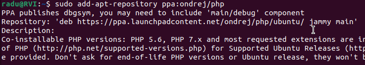


16. Una vegada hem instalat, comprovem per actualitzacións dels nsotres paquets, per tant executarem

 ```
 sudo apt update
 ```


17. Ara ja instalem PHP i els seus móduls. I executarem la comanda

```
sudo apt install php7.4 libapache2-mod-php7.4 php7.4-common php7.4-mbstring php7.4-xmlrpc php7.4-soap php7.4-apcu php7.4-smbclient php7.4-ldap php7.4-redis php7.4-gd php7.4-xml php7.4-intl php7.4-json php7.4-imagick php7.4-mysql php7.4-cli php7.4-mcrypt php7.4-ldap php7.4-zip php7.4-curl -y
```
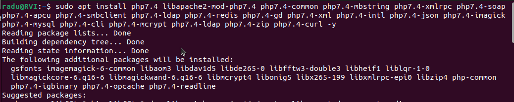


18. Una vegada ho tenim, mun anirem a cambiar alguns paràmetres. Executarem aquesta comanda

```
sudo nano /etc/php/7.4/apache2/php.ini
```


17. Ara hem de cambiar aquests valors importants

a) A la línia 409, cambiarém el limit de memòria a **256MB**

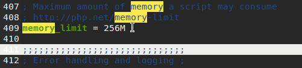

b) Després a la línia 846, cambiaŕem la mida máxima de pujada a la mida que vulguem, pero nosaltres ho posarém de **100MB**

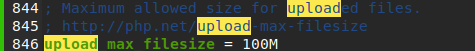

c)  Després a la línia 482, mos asegurem que `display_errors` está en `off`

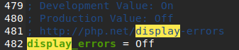


d) Finalment, a la línia 962, posarem la zona de hora, en `Europe/Madrid`


18. Ara instalarem OwnCloud. Primer que tot, mun anirem a la carpeta `/tmp`, i executarem aquesta comanda per descarregar el fitxer de l'OwnCloud


`wget https://download.owncloud.com/server/stable/owncloud-complete-latest.zip`


19. Una vegada lo hem descarregat, el descomprimim

```
unzip owncloud-10.0.8.zip
```


20. Una vegada ho tenim descomprimit, el mourem a la carpeta del servidor web

```
sudo mv owncloud /var/www/html/owncloud/
```


21. Cambiarem el propietari de OwnCloud per los usuaris. Així que executarem esta comanda


```
sudo chown -R www-data:www-data /var/www/html/owncloud/
```


22. Després cambiarem los permisos per los usuaris i administrador

```
sudo chmod -R 755 /var/www/html/owncloud/
```


23. Ja hem conseguit instalar OwnCloud en la nostra màquina.
